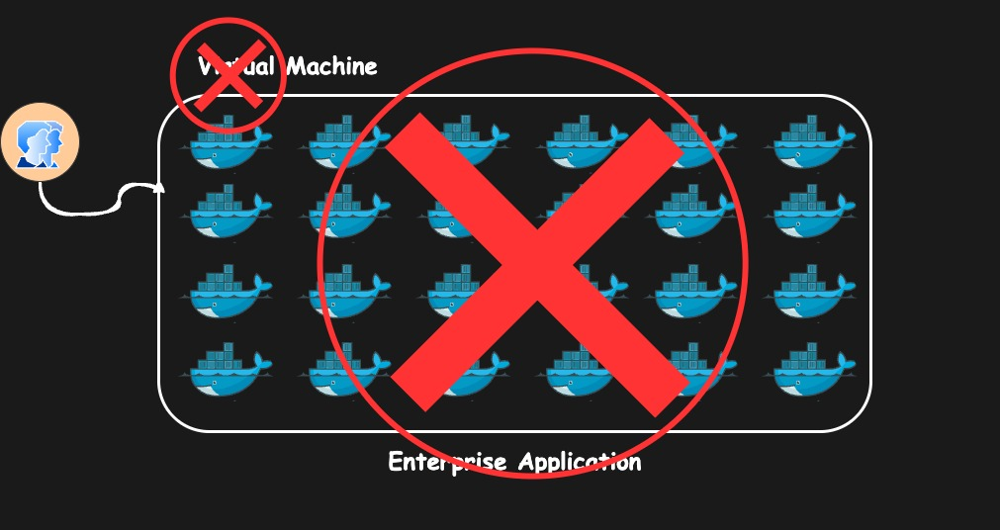

# Why Kubernetes Is Used - Kubernetes Simply Explained

Let's say you have a small application it has a couple of containers maybe three four five containers and it is hosted on a virtual machine at the moment right everything is working fine everything is healthy your users are healthy your Dev team operations team everyone is happy 

Now let's say one of the container goes down so that will impact the user right like this could be a front end this could be a database this could be a back end in any case it will impact your realtime user 

so to fix the issue you have assigned a team let's say it has a couple of uh operations or assist admins who just you know logged into the system log to the virtual machine SSS into that and then uh look at the container locks and try to fix the issue as soon as possible so that your users are happy again this is fine like in case this is a small application that's not an issue right you can do that you can have just a one person or two person assigned to the application and they will take care of it but what if it happen in off hours um like that person if one or two person you have assigned for this that person cannot work for 24/7 right so you have to assign a dedicated support throughout 24/7 and U if it is a application that is accessed by users globally you have to take care of all the time zones how would you manage that it will come with a lot of expenses right you have to keep your team in all the time zones that means you have to hire more people and it is is not even advisable to do that for a small application 

Now let's assume you don't have a small application you have a big Enterprise Gade application with hundreds or even thousands of container running on a virtual machine right in that case you have assigned a big team to it that's fine 

but let's say if multiple container crashes at the same time let's say eight or 10 container goes down so how would you manage that like it will be a hassle for you know a couple of person to look into everything at the same time and when it is a production outage that means your users are impacted you don't have a lot of time to debug and fix the issue and it could happen like in every 5 minutes 10 minutes or it could happen throughout the day 

so how would you take care of these things how would you make sure your application is up and healthy all the time or with minimum intervention.

let's say your virtual machine on which application goes down what will happen your entire application will go down now what should we do in that case. 

let's say you have to deploy a particular version currently this container is running version of 0.9 you have a big release you have to deploy a newer version application version 1.0 how would you do that and what if this has to happen for hundreds of containers like would you do it manually or would you create some automation around it but it is again a hassle to do that 

now how how would you expose your applications to the realtime users if they all are just serving some API endpoints then it is advisable to use something like an API Gateway right and it will take care of the routing but but if these are just the different components of a web application how would you make sure that uh all the user facing endpoints are exposed like do you have to place an external load balancer in front of that and set up the routing rules it's hassle. 

right now who takes care of networking and resource management and security High availability fall tolerance service Discovery there are a lot of challenges and there are a lot of manual steps that you have to take care by yourself if you were using containers without any orchestration system right so that is why we use kubernetes kubernetes is the answer to all these things it takes care of all of these things with minimum or optimize intervention it also takes care of scalability load balancing orchestration and many other aspects 

> but you have to remember this thing kubernetes is not always the solution 

why I say that because you know let's say you have an application a small application uh the one that we just saw in the last video a to-do list application it's it has let's say only a couple of containers you don't need an entire orchestration system to manage just two containers it's wastage of resources it's wastage of money and it will add a lot of administrative efforts it will add a lot of toil to your team to manage that container because even though if we are using a manage service such as AKs or eks or gke even though you are using a kubernetes manage service then also you have to have some sort of of administrative efforts to manage those clusters to maintain those clusters to make sure that uh your workload is optimized properly and you have to plan your schedule for upgrades patching and so on so there are a lot of things that you have to take care of and it's not just like that your application is microservice based or if you have a containerized application you know you deploy it on kubernetes no that's not a solution you have to analyze each and every expect whether you need kubernetes or not whether you can use something like Docker compost or something like just the containers uh running on a bare metal machine on a virtual machine that should suffice your need or you can use uh let's say a virtual private server just like a digital Ocean droplet or AWS light scale or any image from the gcp or Azure Marketplace that would also uh you know fulfill your needs with minimum cost minimum administrative effort minimum maintenance so you have to do your uh due diligence on this point whether you actually need containers or not okay I hope now you have uh the basic understanding of containers and why we need kubernetes.