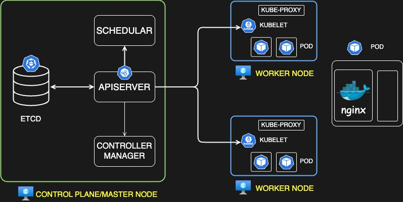
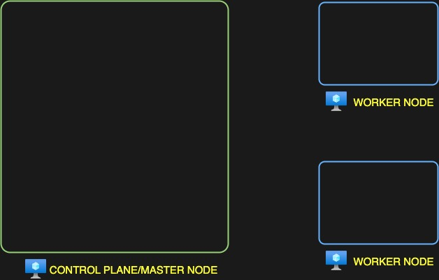
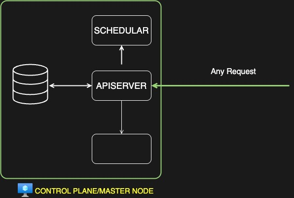
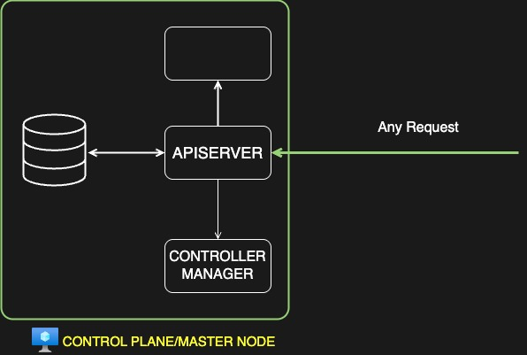
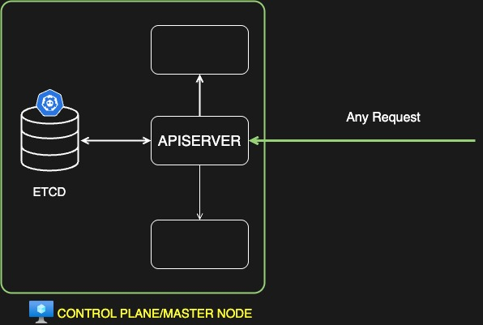
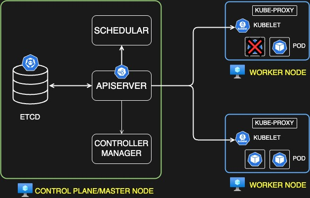
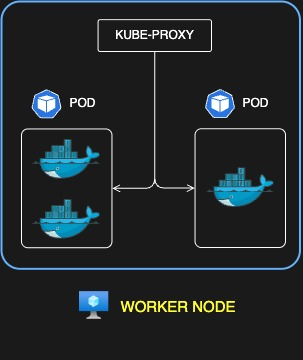

# What is Kubernetes - Kubernetes Architecture Explained

Let's have a look at the kubernetes architecture this might look a little overwhelming at the beginning but if you reaches till the end of this blog I'm sure you will be able to understand everything in depth whatever we'll discuss so on the left side if you see we have a control plane or a master node and on the right side we have a couple of worker nodes now what exactly is a node node is nothing but a virtual machine so so a virtual machine and on which we run our components we run our workloads or we run our uh other administrative components is considered as a node in kubernetes right so this is just another name for a VM if you see we have one for control plane and a couple of virtual machine or nodes for worker nodes now let's understand what exactly is a control plane or Master node.

so A control plane or a master node is a virtual machine or a node that host many administrative components now these components have their own specific purpose and they helps you run your cluster smoothly so basically consider this as a board of director in a company that helps you run the company but they are not doing the actual ground work right they provide instructions to other teams other managers other team leads and other uh resources to work on their behalf right so these are the top level management and on the right side we have worker notes in those worker notes we have the actual working Happening Now idea of running your workload on kubernetes why do we need kubernetes right so we use kubernetes so that we can host our application on the containers that's that's the basic idea like why do you use it those containers run on the worker nodes because that is where actual work is happening but who is instructing kubernetes to to do that work it's the control pane or Master node with the help of different components we'll look at all these different components and you see on the worker node we have something called as pod now what exactly is a pod so look at this diagram on the right side let's say you have a container running it's an enginex container we have already seen what a container is so let's say you have an enginex container running and we cannot run the container in a kubernetes just in its own shell right so we have to encapsulate that in something called as a pod so consider this when there is a baby in the womb it requires a sack to protect the baby right so that's the Pod is that sack and in that pod you can have one or more containers ideally like you only have one container per pod but in some cases you have multiple containers as well these containers are helper containers or sometimes monitoring agents sometimes init containers we'll look at that in in one of the later section but for now just understand you can have one or more container inside a pod and pod is the smallest Deployable unit in kubernetes right so you have uh deployments replicas at Services there will be a lot of other objects that we'll be discussing in detail but for this blog please understand that pod is something that helps you run a container. it encapsulate a container or one or more container in its own so that those container share the resources of a pod and then you run the Pod okay so once that pod is up and running your application inside that container will be up and running it'll be healthy now let's look at these components all of these components one by one okay.

so first we have nodes this we have already discussed uh on the left side we have a control plane or Master node in a high availability in a production environment we usually have more than one notes for the control plane as well to support High availability we'll look that later on but for now just understand worker nodes where your workloads are running your containers your ports your uh all the services and everything will be running and your master node or control plane node is where your control plane components will be running these components like whatever we have seen like API server Schuler SD controller manager these are collectively known as control plane components 

here is your control plane 

**API server** is the center of control plane that means any incoming request from the client will first reach to API server and then API server will interact with other components on its behalf right so any request that comes from outside it will first go to API server so that's the main entry point inside a kubernetes cluster 

okay now 

**schedular** is something that helps you schedule your workload so it received the request from API server okay so here is your API server let's say okay and the scheduler received the request from API server and then it let's say someone requested to schedule a pod right so the request is received by first API server and then API server forward that request to the scheduler to find a suitable node for that part in in a node there could be several constraints like um the CPU the available memory available uh dis storage and so on so those decisions are made by Schuler based on different factors based on are request and limits and there are many other things we'll look at that later but all those factors will be considered by schedular and then it finds a suitable node for that particular part right so that's what Schuler does. 

now we have another component which is controller manager so

**controller manager** is the component which is a combination of many different uh controllers right so we have a *node controller* we have a *namespace controller* we have a *deployment controller* so what this does and there are many other controllers as well so what these controllers does or what controller manager does is make sure that all the controllers are running fine and everything is uh monitored it it basically monitor the workload is basically monitor the kubernetes object and make sure it is up and healthy so let's say if a pod goes down it will monitor that particular pod it will keep re starting that pod because it is continuously monitoring that pod with the help of a controller so that's what controller manager does it makes sure your uh your workloads your uh nodes your deployments everything is up and healthy all the time

then we have hcd so hcd is nothing but a key **value data store** right so key value data store like if you have not familiar with this term let me explain you a little bit what exactly is a key value data store so let's say you have a database and like uh rdbms a relational database which is in form of uh rows and columns right so let's say you have this row and then you have this row you have columns okay so this field is ID this field is name this field is let's say age this field is sex okay so this is your employee table I'm just going to add the details over here so this is your employee table you add all the details in different rows for one employee two employee three employee and so on but let's say we have another employee with the id2 okay and for this employee we have to add one more field which is let's say address over here right we cannot add the address unless we alter the table unless we add one more field over here which is address right why do we need to do that because relational database they have a fixed schema and every record in that table have to follow that schema right so you cannot add fields from your side for every single record so those were the thing that were complicated in relational database and for some use cases where we need to have some random fields or something that is a schema less we cannot follow rdbms right so so for that we have key value data store a key value data store which is schales which is a no SQL database and in that you store your values as per your needs in a document format so this document is generally you know a Json type format and you store your value in key value like let's say there is one record which says name p okay age 35 or 34 I'm I'm not sure and then address XYZ and so on so this particular record will be stored in a document as a Json format and it is in the form of key value pair that means it has a key and a value key and a value and so on right so as I was mentioning that at CD is a key value data store but what values does it store and why do we need to store the value values in that database so it stored everything every single information about the cluster it store cluster information it State um the details of Nod PS configuration secrets and every other relevant data in the key value data store whenever you make any changes in the cluster let's say you receive a request from the client and your API server apply that changes that change will be instantly updated in the at CD database so every single details are updated in the at CD database and only API server so we have API server over here only API server will interact with the at CD database and it will only have the authority to apply those changes in the at CD database at the same time uh the changes will be applied to the at CD database with from API server but at the same time if we have to retrieve any information from ATC database like let's say we want to know how many ports are running in the cluster currently so that instructions will also be retrieved by API server from the at CD database right so this is what it will do right so that's the main purpose of at CD database and it has to be available all the time in fact all the control plane components has to be available all the time and we'll be looking into more scenario based blogs dedicated to each of these components we'll be doing many Hands-On in the future as part of this series so don't worry about it for now I just wanted to give you a brief overview and some uh basic understanding of all the control plane components so these were those.

 

now we have two components running in your worker nodes one is a **KUBE PROXY** another one is a **KUBELET** so cuet is something that receives your instructions from your control plane node let's say this is your control plane or Master node and it has different components that we have seen so let's say you have your API server over here okay API server what it will do is it will sends the instruction to cuade to make some changes in the worker node and every worker node will have the cuade and Cube proxy running so cuade will receive the instruction from API server and then it will act upon that let's say cuet we receive the instruction to delete a pod right so it will go ahead and it will make the changes over here and then it will delete this particular pod right the Pod will be deleted and then it will provide the response as well okay it will go ahead to the API server and it will say the API server that yes this particular pod has been deleted and then API server will make that change in the at ETCD database right so this is what cuet does it is a node based agent and which receive the request from the API server and it enables the communication between you know what it did actually it enabled the communication between worker node and the control plane node right so that's what it did. 

the next component we have is **kube proxy** right so 

 

**kube proxy** is something that enables the networking within the node. it allows your pod to communicate with each other it basically creates some IP table rules and that enables the port to port networking and you know your port and services can communicate with each other with the help of kube proxy, so those were the main things. 

 

Now let me try to explain it with the help of an example like how the end to end flow will work uh in a kubernetes architecture. 

Let's say you have a user user an external client maybe a kubernetes administrator or someone from your devops team and we call it a user that user uses a client CLI utility called Cube CTL, so we'll see that later on, but just understand Cube CTL is a type of client that helps you interact with the cluster and its control plane components so that uh user basically what did did it uses that Cube CTL client and made a request with the API server.

it use the kube CTL client now the request when uh the API server receives the request whatever request it is it will do a lot of things so it will you know I'll just write it on the right side it will first authenticate the request then whether this is a valid request if the user has certain permissions to do that so it authenticate the request and then it also validate the request whether this is a valid request like if it is even supported by kubernetes or the kube CTL client right so it does all those things. 

then uh let's say the request was to create the pod uh okay okay so we use a command such as 

1. `kubectl create pod` 

and the details of the pod like uh it's image, port and many other details so we'll look at that later on but just understand for now the user sends this request to create a pod to the API server once the request is received by API server it does the basic checks it does the authentication it does the validation and so on and then it basically set that request to ETCD database okay 

2. `create pod`

to create the pod now at ETCD database will not because it's a database it will not create the pod but what it will do is it will create an entry in the database that yes the Pod has been created okay so the request will be sent to ETCD database to add an entry inside the at ETCD database 

3. `entry created`

now once you did that once the entry has been made then ETCD server sends the response back to the API server that yes the entry has been created.

4. then we have a scheduler running all the time right so scheduler is monitoring the control plane all the time 

5. scheduler finds that okay there is a pod that needs to be scheduled on a node right so it it finds that that yes I need to make that scheduling Arrangement so schedu basically says to API server that yes I found a pod I found a node okay and 

go ahead and schedule the pod on this node okay now the scheduler made that request to the API server now the next part is to schedule the Pod right the Pod has not been scheduled we have the entry in the ETCD database scheduler found that we have a node available for this particular pod now it it only sends the instructions to the API server every component sends details or requested metadata to the API server and API server is the one who takes the decision 

6. so then API server interacts with cuets okay let's say it found this particular node `node A` okay that's it schedule the part on this node so API server reach out to the cuet of this particular node "hey I have a job for you, schedule this pod on your node" receiving that request cuet will schedule the Pod right on this particular node and 

7. then it will send the detail back to API server that pod has been created Now API server uh will then 

8. add the entry in the database in the ETCD database that yes pod has been created now all the the work has been completed and 

9. then it finally sends the detail to the user that uh the part that you have requested has been created now okay so user will finally receive that request okay.

if let's say instead of create pod the request was to get the Pod to **check how many pods are running in the node** so what it will do okay API server will receive the request it will **authenticate** and **validate** the request okay once the request is validated it will get the information from ETCD database okay so user which is authenticated has requested how many pods are running in this particular name space so it will retrieve that detail from that database and it will send the response back to the user in this case it does not have to check in the cluster for the number of running Parts because this is a database with every single details stored in it so it just have to look inside the database and then it will return with the results so that's what it does 

to recap what have we done so we have seen it will first authenticate and validate the request and then it will retrieve and update the the data in SD right retrieve an update in ETCD then it will take instructions from scheduler which is continuously monitoring if there is any pending pod to be scheduled if there is any pending action item for me and once it found that so it will uh you know instruct API server to schedule that pod now it will also provide the node details right and once it has API server has the node details it will send the request to cuet okay I found a note and I see you have some uh resources I see you are the best fit out of the available nodes and go ahead and schedule this p on your node okay and then it will send the response back to API server I hope it is still visible uh yes okay we'll set the response back to API server and API server then send the response back to client okay so this is generally um the workflow that it takes and this is how it works but if you still have doubts um we'll be covering that in detail so don't worry about it we'll be looking at each of these component how it works and we'll simulate some failure scenarios so that you will know know where to look for if you're getting certain error or which component is responsible for doing this particular action and so on so everything will be clear but for now from a high level just try to understand the flow that it takes the basic purpose of each of these control plane components and uh the components that are running or work not such as kube proxy and kubelet so that's that's the basic overview of kuber it is architecture and I hope you found this blog valuable as well and let me know in the comment section what you think about it.